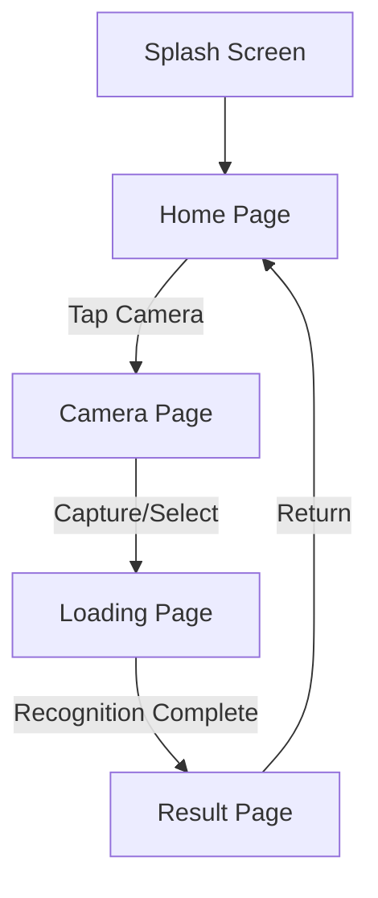

# Artico App - User Flow & Feature Specification

## Overview

Artico is a mobile application enabling users to explore artworks through their phone camera. The app delivers a seamless, artistic, and immersive experience by combining:

- Visual artwork recognition
- Dynamic storytelling with typing animations
- Real-time audio narration

## User Journey Flow

## Detailed Page Specifications

### 1. Splash Screen
- **Duration**: 1.5 seconds auto-transition
- **Design**:
  - Fullscreen dark background
  - Centered minimalistic Artico logo (white thin border)

### 2. Home Page
- **Top Section**:
  - Current date, and city, display
  - Contextual greeting (e.g., "Good Evening")
- **Center Section**:
  - Prominent camera button/icon
- **Bottom Section**:
  - Chronological list of scanned artworks
  - Placeholder message if no scans exist
- **Interactions**:
  - Camera button → Camera Page

### 3. Camera Page
- **Main View**:
  - Live camera preview
  - Centered transparent framing guide
- **Controls**:
  - Primary shutter button
  - Gallery picker icon
- **Behavior**:
  - Direct transition to Loading Page after capture/selection
  - No confirmation step

### 4. Loading Page
- **Design Elements**:
  - Gradient/dark background
  - "Identifying artwork..." text
- **Animation**:
  - Artwork mask reveal effect
  - Progressive blur-to-sharp transition
- **Backend**:
  - Parallel artwork recognition processing

### 5. Result Page
- **Layout**:
  - Full-width responsive artwork image
  - Scrollable explanation section
- **Interactive Elements**:
  - GPT-style typing animation
  - Synchronized audio narration
  - Return to Home button
- **Features**:
  - Auto-save to local collection

## Core Features

1. **One-Click Scanning**
   - Streamlined capture without confirmation dialogs
   - Direct flow from capture to results

2. **Visual Experience**
   - Artistic loading animations
   - Dynamic cut-out effects
   - Smooth transitions

3. **Content Presentation**
   - Typing animation for artwork descriptions
   - Synchronized text-to-speech narration
   - High-quality voice output

4. **Local Management**
   - Artwork collection storage
   - Chronological organization
   - Offline access capability

## Design Guidelines

### Visual Style
- **Theme**: Dark mode primary
- **Aesthetic**: Minimalistic and elegant
- **Typography**: Modern sans-serif (Inter/Helvetica Neue)
- **Color Palette**:
  - Primary: Deep dark backgrounds
  - Accents: Light elegant elements

### Animation Guidelines
- Smooth, fluid transitions
- Progressive reveal effects
- Subtle breathing animations
- Natural typing rhythm

## Technical Requirements

- Real-time camera processing
- Artwork recognition API integration
- Local storage management
- Audio synthesis capability
- Smooth animation performance
